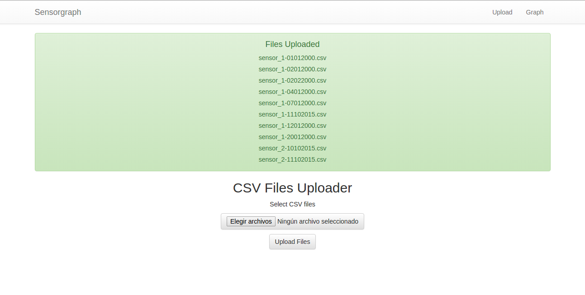
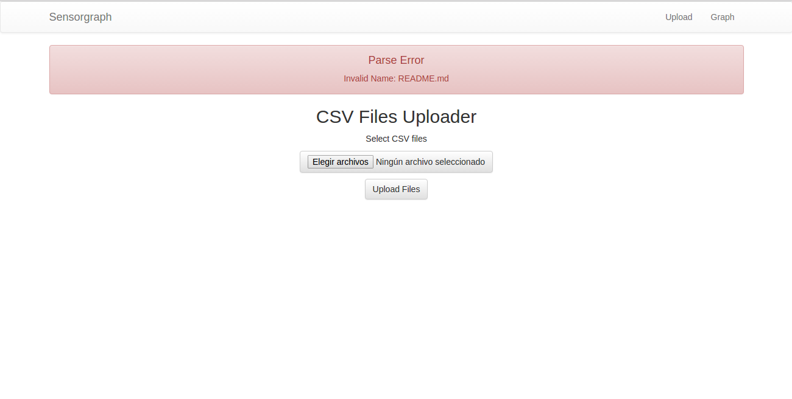
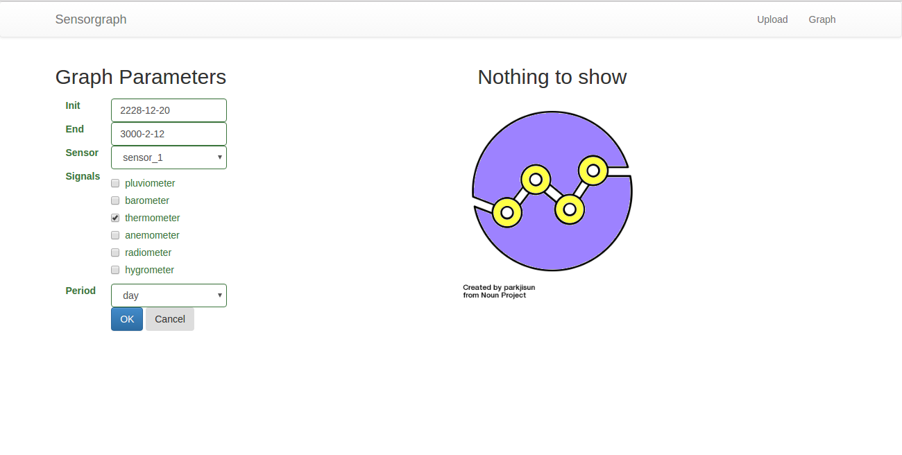
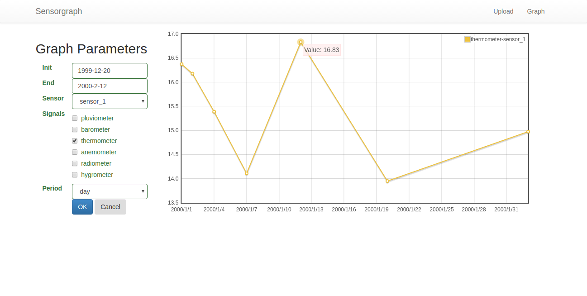

#SensorGraph

Python3 Django WebApp to draw datasets of different measure sensors grouped in days, weeks or months.

##Install

```sh
pip3 install -r requirements.txt
cd  sensorweb
python3 manage.py migrate
python3 manage.py runserver
```

##How to use

###Upload Files Page

There is a set of csv test files in the csv folder.

####Files Uploaded


####Upload error feedback


###Graph Page

With the csv test files you can see the thermometer sensor_1 signal between 1999 and 2000.

####No data to display


####Graph with data


##Components

* [django](https://github.com/django/django)
* [django-graphos](https://github.com/agiliq/django-graphos)
* [python-dateutil](https://pypi.python.org/pypi/python-dateutil)
* [jquery](https://jquery.com/)
* [bootstrap](https://github.com/twbs/bootstrap)
* [flot](https://github.com/flot/flot)
